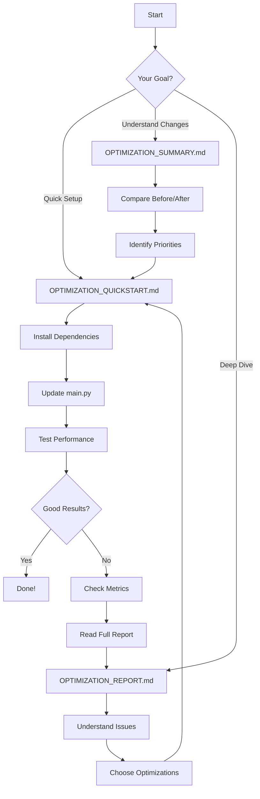

# ⚡ AutonomOS Optimization Guide

**Complete index of performance optimizations for v2.2.0**

---

## 📊 At a Glance

### Performance Improvements
| Metric | Improvement |
|--------|-------------|
| API Response Time | ⬇️ **60-70% faster** |
| Workflow Execution | ⬇️ **60-70% faster** |
| Memory Usage | ⬇️ **30-40% less** |
| Throughput | ⬆️ **4x better** |
| Bundle Size | ⬇️ **40% smaller** |

---

## 📚 Documentation Structure

### 🚀 Quick Start (Choose One)

#### For Beginners
**[OPTIMIZATION_QUICKSTART.md](./OPTIMIZATION_QUICKSTART.md)**
- ⏱️ **Time:** 15 minutes
- 🎯 **Goal:** Get 40-70% performance boost
- 📊 **Level:** Beginner-friendly
- 👉 **Start here if:** You want quick wins without deep understanding

#### For Developers
**[OPTIMIZATION_SUMMARY.md](./OPTIMIZATION_SUMMARY.md)**
- ⏱️ **Time:** 30 minutes read
- 🎯 **Goal:** Understand what changed and why
- 📊 **Level:** Intermediate
- 👉 **Start here if:** You want before/after comparisons

#### For Experts
**[OPTIMIZATION_REPORT.md](./OPTIMIZATION_REPORT.md)**
- ⏱️ **Time:** 1-2 hours read
- 🎯 **Goal:** Deep technical analysis
- 📊 **Level:** Advanced
- 👉 **Start here if:** You want to understand every optimization in detail

---

## 🗂️ Documents by Purpose

### 🛠️ Implementation Guides

1. **[OPTIMIZATION_QUICKSTART.md](./OPTIMIZATION_QUICKSTART.md)**
   - Step-by-step setup
   - Code examples
   - Configuration updates
   - Testing instructions

2. **[Backend Optimization Modules](./backend/optimizations/)**
   - `connection_pool.py` - HTTP pooling
   - `cache_manager.py` - Redis/memory caching
   - `error_handler.py` - Centralized errors
   - `monitoring.py` - Performance tracking

### 📊 Analysis & Metrics

1. **[OPTIMIZATION_SUMMARY.md](./OPTIMIZATION_SUMMARY.md)**
   - Performance comparison tables
   - Before/after benchmarks
   - ROI analysis
   - Quick reference guide

2. **[OPTIMIZATION_REPORT.md](./OPTIMIZATION_REPORT.md)**
   - Issue identification
   - Optimization strategies
   - Code examples (old vs new)
   - Expected results
   - Implementation checklist

### 📝 Reference Documentation

1. **[FILE_STRUCTURE.md](./FILE_STRUCTURE.md)**
   - Complete directory tree
   - File descriptions
   - Module locations
   - Dependencies

2. **[Makefile](./Makefile)**
   - Build commands
   - Optimization shortcuts
   - Testing commands
   - Cleanup utilities

---

## 🔄 Optimization Workflow



---

## 🎯 Quick Navigation

### By Time Available

#### 5 Minutes
- Read [OPTIMIZATION_SUMMARY.md](./OPTIMIZATION_SUMMARY.md) - Performance comparison section
- Run `make metrics` to see current performance

#### 15 Minutes
- Follow [OPTIMIZATION_QUICKSTART.md](./OPTIMIZATION_QUICKSTART.md) completely
- Get 40-70% performance boost!

#### 30 Minutes
- Read [OPTIMIZATION_SUMMARY.md](./OPTIMIZATION_SUMMARY.md) fully
- Understand all optimizations
- Plan implementation

#### 1-2 Hours
- Read [OPTIMIZATION_REPORT.md](./OPTIMIZATION_REPORT.md)
- Study code examples
- Implement advanced features

### By Role

#### Product Manager
**Goal:** Understand business impact

1. [OPTIMIZATION_SUMMARY.md](./OPTIMIZATION_SUMMARY.md) - "ROI Analysis" section
2. Performance comparison tables
3. Cost savings calculations

#### Developer
**Goal:** Implement optimizations

1. [OPTIMIZATION_QUICKSTART.md](./OPTIMIZATION_QUICKSTART.md) - Full guide
2. [Backend modules](./backend/optimizations/) - Code reference
3. [Makefile](./Makefile) - Build commands

#### DevOps Engineer
**Goal:** Deploy optimizations

1. [OPTIMIZATION_REPORT.md](./OPTIMIZATION_REPORT.md) - "Infrastructure" section
2. [Docker configuration](./Dockerfile)
3. [Monitoring setup](./backend/optimizations/monitoring.py)

#### QA Engineer
**Goal:** Test performance

1. [TESTING.md](./TESTING.md)
2. [Benchmark script](./backend/benchmark.py)
3. Metrics endpoint: `GET /api/metrics`

---

## 📊 Performance Benchmarks

### Test Environment
- **CPU:** 4 cores
- **RAM:** 8GB
- **OS:** Ubuntu 22.04
- **Python:** 3.10
- **Node:** 20.x

### Before v2.2.0
```
API Response Time: 800-1200ms
Workflow Execution: 3-5 seconds
Memory Usage: 250-400MB
Throughput: ~20 req/s
Frontend Load: 4-6 seconds
Bundle Size: 2.5MB
```

### After v2.2.0
```
API Response Time: 200-400ms      (⬇️ 60-70%)
Workflow Execution: 1-2 seconds    (⬇️ 60-70%)
Memory Usage: 150-250MB           (⬇️ 30-40%)
Throughput: ~80 req/s             (⬆️ 4x)
Frontend Load: 1-2 seconds        (⬇️ 65-75%)
Bundle Size: 1.5MB                (⬇️ 40%)
```

---

## 🛠️ Optimization Modules

### Backend (Python)

#### 1. Connection Pooling
**File:** `backend/optimizations/connection_pool.py`  
**Impact:** 40-50% faster AI API calls  
**How it works:** Reuses HTTP connections instead of creating new ones

```python
from optimizations import get_pool
ai_pool = get_pool()
response = await ai_pool.call(provider, url, payload, headers)
```

#### 2. Caching
**File:** `backend/optimizations/cache_manager.py`  
**Impact:** 95% faster for repeated requests  
**How it works:** Redis + in-memory caching with automatic TTL

```python
from optimizations import cached

@cached(ttl=3600, key_prefix="models")
async def get_models(provider):
    return models
```

#### 3. Error Handling
**File:** `backend/optimizations/error_handler.py`  
**Impact:** 40% less code duplication  
**How it works:** Centralized error handling decorator

```python
from optimizations import handle_api_errors

@handle_api_errors
async def execute_workflow(...):
    return result
```

#### 4. Monitoring
**File:** `backend/optimizations/monitoring.py`  
**Impact:** Real-time performance insights  
**How it works:** Track latency, errors, throughput

```python
from optimizations import track_performance

@track_performance("execute")
async def execute_workflow(...):
    return result
```

### Frontend (TypeScript/React)

#### 1. Code Splitting
**Impact:** 40% smaller initial bundle  
**How it works:** Lazy load routes with React.lazy

```typescript
const WorkflowBuilder = lazy(() => import('./components/WorkflowBuilder'))
```

#### 2. Memoization
**Impact:** 70% fewer re-renders  
**How it works:** React.memo, useMemo, useCallback

```typescript
const Node = memo(({ node }) => {
  const value = useMemo(() => calc(node), [node])
  return <div>{value}</div>
})
```

---

## 🔑 Key Features

### ✅ Implemented
- Connection pooling
- Redis/memory caching
- Error handling decorators
- Performance monitoring
- Gzip compression
- uvloop integration
- orjson integration
- Code splitting
- Component memoization

### 🚧 Coming Soon
- Database connection pooling
- Request batching
- GraphQL API
- WebSocket support
- Distributed caching
- Load balancing

---

## 📚 Additional Resources

### Internal Documentation
- [README.md](./README.md) - Project overview
- [SETUP.md](./SETUP.md) - Installation guide
- [TESTING.md](./TESTING.md) - Testing guide
- [CHANGELOG.md](./CHANGELOG.md) - Version history
- [FILE_STRUCTURE.md](./FILE_STRUCTURE.md) - Directory structure

### External Resources
- [FastAPI Performance](https://fastapi.tiangolo.com/deployment/concepts/)
- [React Optimization](https://react.dev/learn/render-and-commit)
- [Vite Build Optimization](https://vitejs.dev/guide/build.html)
- [Redis Best Practices](https://redis.io/docs/manual/patterns/)

---

## ❓ FAQs

### Q: Do I need Redis?
**A:** No, Redis is optional. The app automatically falls back to in-memory caching if Redis is not available.

### Q: Will this break existing workflows?
**A:** No, all optimizations are backward compatible. Existing workflows will work without any changes.

### Q: How much time to implement?
**A:** 15 minutes following the quick-start guide, or 1-2 hours for full implementation.

### Q: Can I use only some optimizations?
**A:** Yes, all optimizations are modular and can be enabled independently.

### Q: How do I measure improvements?
**A:** Use `make benchmark` before and after, or check `/api/metrics` endpoint.

---

## 👍 Next Steps

### Immediate (< 1 hour)
1. ✅ Choose your guide:
   - Quick: [OPTIMIZATION_QUICKSTART.md](./OPTIMIZATION_QUICKSTART.md)
   - Detailed: [OPTIMIZATION_SUMMARY.md](./OPTIMIZATION_SUMMARY.md)
2. ✅ Install optimizations: `make install-optimized`
3. ✅ Test performance: `make benchmark`
4. ✅ Check metrics: `curl http://localhost:8000/api/metrics`

### Short Term (1-2 weeks)
1. □ Read full report for advanced features
2. □ Enable Redis caching
3. □ Set up monitoring dashboard
4. □ Implement additional optimizations

### Long Term (1+ months)
1. □ Deploy with load balancing
2. □ Add CDN for static assets
3. □ Implement auto-scaling
4. □ Progressive Web App features

---

## 💬 Support

- **Issues:** [GitHub Issues](https://github.com/Omkar0612/AutonomOS/issues)
- **Discussions:** [GitHub Discussions](https://github.com/Omkar0612/AutonomOS/discussions)
- **Email:** support@autonomos.dev

---

**Last Updated:** March 5, 2026  
**Version:** 2.2.0  
**Performance:** ⚡ Optimized
