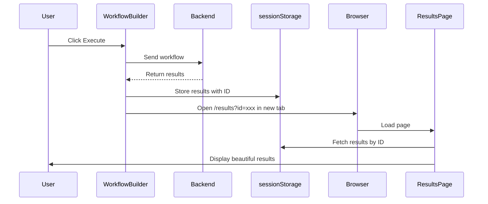

# 🎉 NEW: Dedicated Results Page with Export Options

## ✨ What Changed?

We've transformed the execution results experience from a bottom panel to a **full-page dedicated results view** that opens in a new tab!

---

## 🔄 Before vs After

### ❌ Before (Bottom Panel)
- Results showed at bottom of workflow canvas
- Limited space (covered 2/3 of screen)
- Hard to focus on results while editing workflow
- Export buttons cramped

### ✅ After (Dedicated Page)
- Full-page results view in new tab
- Beautiful card-based layout
- Metrics dashboard at top
- Large export buttons (7 formats)
- Print-friendly design
- Share via URL
- Keep workflow canvas clean

---

## 🔗 New Route

```
http://localhost:3000/results?id=<timestamp>
```

Results are stored in `sessionStorage` with unique IDs, allowing:
- Multiple result tabs open simultaneously
- Share results URL with team
- Go back to specific execution

---

## 🎨 New Features

### 1️⃣ Metrics Dashboard
4 stat cards at the top:
- **Status** - Overall execution status
- **Total Nodes** - Number of nodes executed
- **Successful** - Count of successful nodes
- **Errors** - Count of failed nodes

### 2️⃣ Execution Details Card
Displays:
- Provider (OpenRouter, OpenAI, etc.)
- Model name
- Timestamp
- Workflow name

### 3️⃣ Export Options Grid
7 large, beautiful export buttons:

| Format | Icon Color | Description |
|--------|-----------|-------------|
| PDF | Red gradient | Professional report |
| Word | Blue gradient | Editable document |
| Excel | Green gradient | Data & charts |
| PowerPoint | Orange gradient | Presentation |
| JSON | Purple gradient | Raw data |
| CSV | Teal gradient | Spreadsheet |
| Markdown | Gray gradient | Documentation |

### 4️⃣ Node Results Cards
- Clean card design for each node
- Status badges (green success / red error)
- Task description
- Output/error boxes with syntax highlighting
- Smooth animations on load

### 5️⃣ Action Buttons
- **Back** - Return to workflow
- **Copy** - Copy all results to clipboard
- **Share** - Copy page URL
- **Print** - Print-friendly layout

---

## 💻 How It Works

### Workflow Execution Flow



### Code Changes

#### 1. New ResultsPage Component
**File:** `frontend/src/pages/ResultsPage.tsx`
- Full-page component
- Reads results from sessionStorage
- Displays metrics, export buttons, and node results
- Handles all 7 export formats

#### 2. Updated WorkflowBuilder
**File:** `frontend/src/components/WorkflowBuilder.tsx`
- Removed ExecutionResultsPanel import
- Stores results in sessionStorage after execution
- Opens new tab with `/results?id=xxx`
- Adds "Results" button to re-open last execution
- Cleaner canvas (no overlay)

#### 3. Updated App Routing
**File:** `frontend/src/App.tsx`
- Added `/results` route (outside Layout)
- ResultsPage renders without sidebar/nav

---

## 🚀 Usage

### Step 1: Execute Workflow
1. Build your workflow
2. Click **Execute** button
3. Wait for completion

### Step 2: Auto-Open Results
- Results page opens **automatically** in new tab
- Toast notification confirms success
- "Results" button appears in workflow for re-opening

### Step 3: View & Export
- See metrics dashboard
- Scroll through node results
- Click any export button
- File downloads instantly

### Step 4: Share Results
- Click **Share** button
- URL copied to clipboard
- Send to team members
- They can view same results

---

## 📸 UI Preview

### Header
```
← Back     🎯 Execution Results
            workflow

                          Copy | Share | Print
```

### Metrics (4 cards in row)
```
┌─────────────┐ ┌─────────────┐ ┌─────────────┐ ┌─────────────┐
│   Status    │ │ Total Nodes │ │ Successful  │ │   Errors    │
│   ✅        │ │     ⚡      │ │     ✅      │ │     ❌      │
│  Success    │ │      3      │ │      3      │ │      0      │
└─────────────┘ └─────────────┘ └─────────────┘ └─────────────┘
```

### Export Grid (4 columns)
```
┌───────────────┐ ┌───────────────┐ ┌───────────────┐ ┌───────────────┐
│  📄 Export    │ │  📝 Export    │ │  📊 Export    │ │  📈 Export    │
│      PDF      │ │     Word      │ │     Excel     │ │  PowerPoint   │
│  Professional │ │   Editable    │ │  Data/charts  │ │ Presentation  │
└───────────────┘ └───────────────┘ └───────────────┘ └───────────────┘

┌───────────────┐ ┌───────────────┐ ┌───────────────┐
│  🔧 Export    │ │  📉 Export    │ │  📋 Export    │
│     JSON      │ │      CSV      │ │   Markdown    │
│   Raw data    │ │  Spreadsheet  │ │ Documentation │
└───────────────┘ └───────────────┘ └───────────────┘
```

### Node Results
```
┌─────────────────────────────────────────────────┐
│ 📦 agent-1                     ✅ success       │
│                                                 │
│ Task: Research AI market trends                 │
│                                                 │
│ ┌─ Output ────────────────────────────────┐    │
│ │ [AI-generated market research...]       │    │
│ └─────────────────────────────────────────┘    │
└─────────────────────────────────────────────────┘
```

---

## 🔧 Technical Details

### sessionStorage Keys
```javascript
// Store results
sessionStorage.setItem(`autonomos-results-${timestamp}`, JSON.stringify(result))

// Store workflow name
sessionStorage.setItem(`autonomos-workflow-name-${timestamp}`, 'workflow')

// Retrieve
const result = JSON.parse(sessionStorage.getItem(`autonomos-results-${id}`))
const name = sessionStorage.getItem(`autonomos-workflow-name-${id}`)
```

### URL Parameters
```
/results?id=1709635200000
```

### Print Styles
All UI elements have `print:hidden` class except:
- Metrics cards
- Node results
- Execution details

Result: Clean printable report!

---

## ✨ Benefits

### For Users
1. **Focus** - Dedicated space for results
2. **Compare** - Open multiple result tabs
3. **Share** - Send URL to teammates
4. **Export** - Large, clear export buttons
5. **Clean** - Workflow canvas stays uncluttered

### For Developers
1. **Separation** - Results logic isolated
2. **Scalability** - Easy to add features
3. **Performance** - No heavy panel on workflow page
4. **Flexibility** - Can enhance independently

---

## 📝 Files Changed

1. **frontend/src/pages/ResultsPage.tsx** ✨ NEW
   - Full results page component
   - 400+ lines

2. **frontend/src/components/WorkflowBuilder.tsx** 🔄 UPDATED
   - Removed ExecutionResultsPanel
   - Added sessionStorage logic
   - Opens new tab on execution

3. **frontend/src/App.tsx** 🔄 UPDATED
   - Added `/results` route

4. **frontend/src/components/ExecutionResultsPanel.tsx** ❌ DEPRECATED
   - No longer used (can keep for reference)

---

## 🚀 Next Steps

### To Use:
```bash
cd ~/AutonomOS
git pull origin main
cd frontend
npm install  # (no new deps needed)
npm run dev
```

### Future Enhancements:
- [ ] Save results to backend/database
- [ ] Results history page
- [ ] Compare multiple executions
- [ ] Download all formats as ZIP
- [ ] Email results
- [ ] Custom export templates
- [ ] Results analytics dashboard

---

## 🔍 Testing

1. **Execute a workflow**
   - Should open new tab automatically
   - URL: `/results?id=<timestamp>`

2. **Click Results button**
   - Button appears after first execution
   - Re-opens last results

3. **Try exports**
   - All 7 formats should download
   - Check Downloads folder

4. **Test sharing**
   - Click Share button
   - URL copied
   - Open in new tab/browser

5. **Test print**
   - Click Print button
   - Should show clean layout
   - No sidebar/buttons in print

---

**Made with ❤️ by AutonomOS Team**

**Powered by 40+ FREE AI models ⭐**
